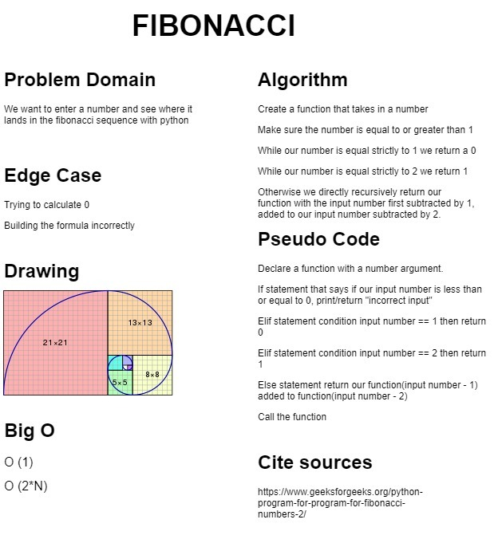
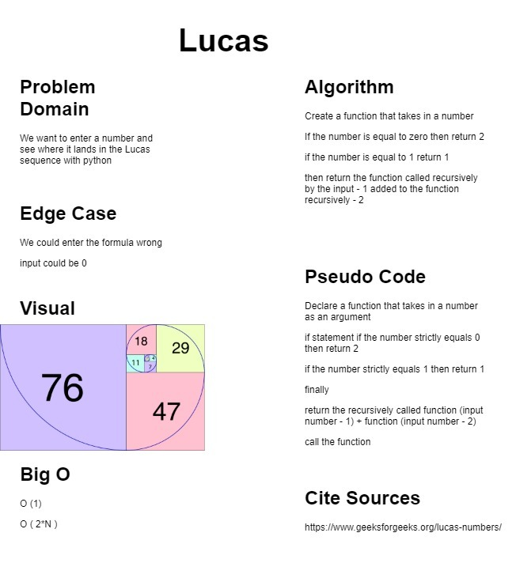

# README

## Math Series

Lab02-Modules, Containers, and Testing

*Author: Alex Angelico*

### Collaborators

Anthony Beaver, Karlo Mangubat, Brandon Gonzalez

----

## Open PR

https://github.com/Alex-Angelico/math-series/pull/1

----

## Description

Given a sequence value and base sequence numbers, output a specific value from a special number sequence (e.g. Fibonacci, Lucas)

----

## Getting Started

Clone this repository to your local machine.

```
$ git clone https://github.com/Alex-Angelico/math-series.git
```

### To run the program from VS Code:

Open VSCode

Navigate to location of cloned repository.

Double click on ```math-series``` directory.

Then select and open ```math_series.py```

----

## Visuals

  


----

## Change Log

1.0: *Added basic functionality* - 9 Dec 2020  
